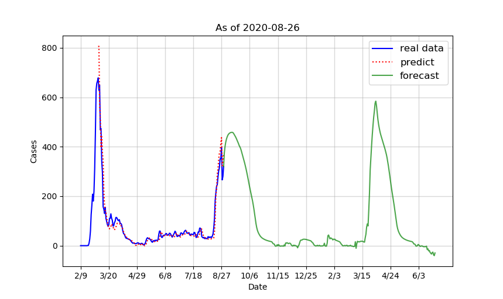
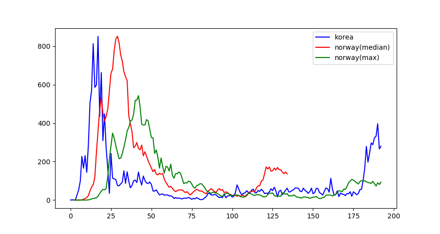

# covid-prediction
코로나19 신규 확진자를 예측하는 프로젝트입니다.


이 repository에는 데이터 크롤링부터, 학습, 예측하는 코드까지 모두 포함되어 있습니다.

- [`data_collect.py`] : 코로나19 신규 확진자 데이터를 크롤링하고 전처리합니다. 신규 확진자 데이터는 www.worldometers.info 에서 제공하는 정보를 사용합니다.
- [`preprocessing.py`] : 크롤링한 데이터를 학습 가능한 형태로 가공합니다.
- [`model.py`] : 모델을 선언합니다. 시계열 예측 문제이므로 LSTM을 사용했습니다.
- [`train.py`] : 학습을 진행합니다.
- [`predict.py`] : 학습된 모델을 사용하여 예측 결과를 시각화합니다.

# 예측 결과


예측은 2020년 8월 27일에 진행하였습니다.

그래프 요소들이 의미하는 바는 다음과 같습니다:
- 파란선 : 실제 대한민국의 신규 확진자 수
- 빨간 점선 : 예측 결과
- 초록선 : 8월 28일 이후의 신규 확진자 수 예측 결과

자세한 예측 결과는 [여기](./predict.md)에서 확인할 수 있습니다.

# 방법
## 1. 데이터
한국의 과거 신규 확진자 데이터만으로는 데이터 수가 적기 때문에 학습을 진행하기 어렵습니다.


이를 해결하기 위한 핵심 아이디어는 다음과 같습니다.


```
어떤 나라든 신규 확진자 수의 변화 추세는 비슷할 것이다.
```


따라서 세계 각국의 코로나 확진자 데이터를 사용하여 학습을 진행합니다.


국가마다 인구수, 인구 밀도 등이 다르므로 한국의 데이터와 유사하도록 리스케일링(rescaling)을 진행했습니다.





위 그래프는 `리스케일링된 노르웨이 확진자 데이터`와 `한국 데이터`를 비교한 그래프입니다.


한국의 데이터와 상당히 유사하다는 것을 알 수 있습니다.


이러한 방식으로 약 85개국에 대해 데이터를 수집하여 학습시켰습니다.


## 2. 학습
코로나 신규 확진자 예측은 시계열 예측 문제입니다.


시계열 예측에는 RNN을 사용하는 것이 유리하므로 LSTM을 사용하였습니다.


# 앞으로..

앞으로는 예측 값과 실제 확진자 수를 비교하는 그래프를 업데이트 하겠습니다.
